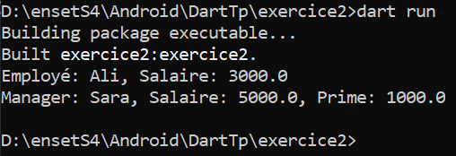

Voici un exemple clair et structuré du contenu que tu peux mettre dans un fichier `README.md` pour **Exercice 2 – Programmation orientée objet** :

---

# Exercice 2 – Programmation Orientée Objet (Dart)

## Objectifs pédagogiques
- Utiliser l'héritage et le polymorphisme en Dart
- Structurer un projet avec plusieurs fichiers (`lib/`)
- Comprendre les similarités avec Java et les différences avec JavaScript

---

## Contenu des fichiers

### `lib/employe.dart`

```dart
class Employe {
  final String _nom;
  final double _salaire;

  Employe({required String nom, required double salaire})
      : _nom = nom,
        _salaire = salaire;

  void afficherInfos() {
    print('Employé: $_nom, Salaire: $_salaire');
  }

  // Getters pour permettre l'accès dans les classes dérivées
  String get nom => _nom;
  double get salaire => _salaire;
}
````

### 🔹 `lib/manager.dart`

```dart
import 'employe.dart';

class Manager extends Employe {
  final double _prime;

  Manager({
    required String nom,
    required double salaire,
    required double prime,
  })  : _prime = prime,
        super(nom: nom, salaire: salaire);

  @override
  void afficherInfos() {
    print('Manager: $nom, Salaire: $salaire, Prime: $_prime');
  }
}
```

### 🔹 `bin/main.dart`

```dart
import '../lib/employe.dart';
import '../lib/manager.dart';

void main() {
  var emp = Employe(nom: 'Alice', salaire: 2500.0);
  var mgr = Manager(nom: 'Bob', salaire: 4000.0, prime: 1000.0);

  List<Employe> staff = [emp, mgr];

  for (var personne in staff) {
    personne.afficherInfos();
  }
}
```

---

## 💬 Questions & Réponses

### ➤ Est-ce que l’héritage fonctionne comme en Java ?

✅ Oui, Dart suit un modèle orienté objet similaire à Java :

* Utilisation de `extends`
* Appel du constructeur parent via `super`
* Possibilité d’override de méthodes avec `@override`

### ➤ Différences avec JavaScript ?

❌ JavaScript n’a pas de vrai héritage de classe (sauf avec ES6).

* JavaScript utilise un modèle basé sur les prototypes.
* Pas de typage fort sans TypeScript.
* Pas de constructeurs nommés ou surcharge de méthodes comme en Dart.


## Capture d’écran (résultat console)

<p align="center">
  
</p>

